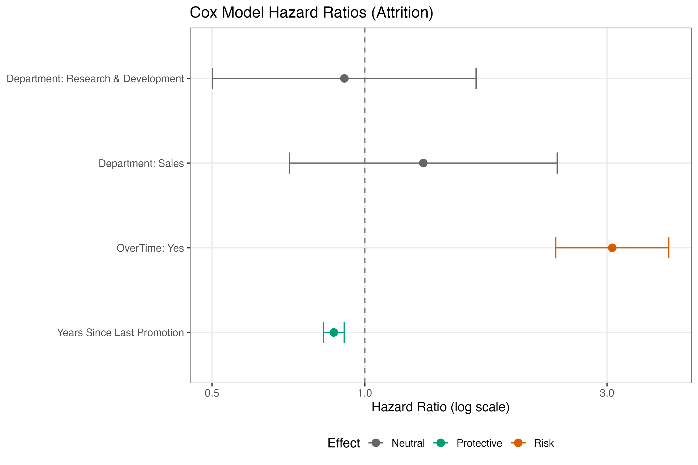

# 📊 Employee Attrition Survival Analysis (IBM HR Dataset)

**Tools:** R · survival · survminer · ggplot2

## Overview

This project applies **survival analysis** to model employee attrition over time using IBM HR data. Rather than treating attrition as a simple yes/no outcome, the analysis explicitly accounts for **time-to-exit** and **censoring** (employees still employed at last observation).

The workflow progresses from **exploratory survival analysis** using Kaplan–Meier curves to **multivariable modeling** with a Cox proportional hazards model, supported by interpretable visualizations and diagnostics.

---

## Key Results at a Glance

- **Sample size:** 1,470 employees  
- **Observed attritions:** 237 (16.1%)  
- **Model performance:** C-index = **0.74**



### Adjusted Effects (Cox Model)

- **OverTime:** Employees working overtime have **~3.1× higher attrition risk**
- **Years Since Last Promotion:** Each additional year is associated with a **~13% reduction in attrition risk**
- **Department:** Differences are not statistically significant after adjustment

| Predictor | Hazard Ratio | 95% CI | Interpretation |
|---------|--------------|--------|----------------|
| OverTime (Yes) | 3.07 | 2.38–3.97 | Strong risk increase |
| Years Since Last Promotion | 0.87 | 0.83–0.91 | Protective per year |
| Department (Sales vs HR) | 1.30 | 0.71–2.39 | Not significant |

## Key Questions

- How does employee retention evolve over time?
- Do attrition patterns differ by department, overtime status, or promotion history?
- Which factors meaningfully increase or reduce attrition risk *after controlling for others*?
- How can survival modeling provide more actionable insights than binary churn models?

---

## Data

- **Source:** IBM HR Analytics Employee Attrition dataset  
- **Unit of analysis:** Individual employee  
- **Outcome variables:**
  - `time` — tenure (in years) until attrition or censoring
  - `event` — attrition indicator (1 = left, 0 = censored)

Employees who had not left the company by the end of the observation period are treated as **right-censored**, allowing their partial tenure information to contribute correctly to the analysis.

---

## Project Structure

```text
HR_Attrition/
├── data/
│   └── IBM-HR-Employee-Attrition.csv
├── outputs/
│   └── hr_survival_df.rds
├── figures/
│   ├── km_overall.pdf
│   ├── km_department.pdf
│   ├── km_overtime.pdf
│   ├── km_promotion_band.pdf
│   ├── cox_forest_color.pdf
│   ├── cox_adjusted_overtime.pdf
│   └── cox_ph_diagnostics.pdf
├── R/
│   ├── 00_setup.R
│   ├── 01_data_prep.R
│   ├── 02_survival_eda.R
│   └── 03_cox_model.R
└── README.md
```

---

## Methods

### 1️⃣ Survival EDA (Kaplan–Meier)

Exploratory survival analysis was conducted using Kaplan–Meier estimators to examine:

- Overall retention over time
- Stratified retention by:
  - Department
  - OverTime status
  - Years since last promotion (banded)

Log-rank tests were used to assess unadjusted differences between groups.

📄 Script: `02_survival_eda.R`

---

### 2️⃣ Cox Proportional Hazards Model

A multivariable Cox proportional hazards model was used to estimate **adjusted attrition risk**, accounting for censoring and multiple predictors simultaneously:

Model outputs include:
- Hazard ratios with 95% confidence intervals
- Concordance (C-index) for model discrimination
- Proportional hazards assumption testing

📄 Script: `03_cox_model.R`

---

## Key Findings

### 🔥 Overtime is the dominant risk factor
- Employees working overtime exhibit **over three times the hazard of attrition**
- Effect is large, precise, and highly statistically significant
- Persists after controlling for department and promotion history

### 🛡 Promotion stability is protective
- Each additional year since last promotion is associated with a **meaningful reduction in attrition risk**
- Suggests survivor effects and increased stability among longer-tenured employees

### 🏢 Department matters less than expected
- Departmental differences largely disappear after adjustment
- Attrition is driven more by **workload intensity** and **career progression dynamics** than by organizational unit

---

## Visualizations

### Adjusted Survival Curves (Cox Model)

Adjusted survival curves compare retention trajectories for employees with and without overtime while holding department and promotion history constant. These plots illustrate how relative risk differences translate into long-term retention outcomes.

### Cox Forest Plot

A forest plot visualizes hazard ratios on a log scale with color encoding:

- 🔴 **Risk factors** — HR > 1 with confidence intervals entirely above 1  
- 🟢 **Protective factors** — HR < 1 with confidence intervals entirely below 1  
- ⚪ **Neutral effects** — confidence intervals crossing 1  

The visualization emphasizes interpretability and decision relevance rather than raw statistical output.

---

## Why Survival Analysis?

Traditional churn models treat attrition as a binary outcome and ignore:

- Time-to-event information
- Right censoring
- Changing risk over tenure

Survival analysis provides:
- Proper handling of incomplete outcomes
- More realistic risk estimation
- Insight into *when* attrition occurs and *why*

---

## Reproducibility

- Scripts use relative paths and can be run end-to-end from the project root
- Outputs are deterministic given the input dataset
- Figures and model summaries are saved to disk for review

---

## Skills Demonstrated

- Survival analysis (Kaplan–Meier, Cox proportional hazards)
- Censoring-aware modeling
- Model diagnostics and interpretation
- Data visualization for decision-making
- Reproducible analytics workflows in R

---

## Next Steps (Optional Extensions)

- Time-dependent covariates
- Parametric survival models (AFT)
- Machine learning survival models (e.g., Random Survival Forests)
- Scenario-based attrition risk simulation

---

## Contact

**Joshua Cole, PhD**  
Data Analytics / People Analytics  
GitHub: https://github.com/JoshuaColePhD