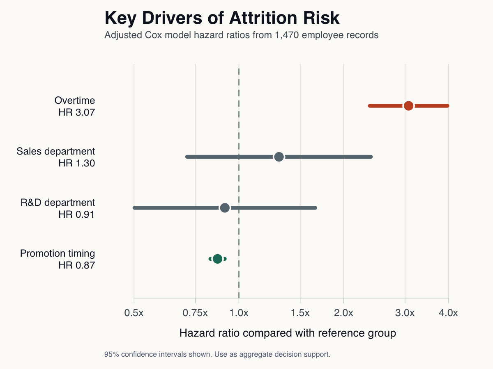

# HR Attrition and Survival Analysis

People analytics portfolio project using Kaplan-Meier survival curves, Cox proportional hazards regression, and an executive-facing dashboard to translate attrition risk into retention decisions.

**Live dashboard:** https://hr-attrition-dashboard.vercel.app  
**Repository:** https://github.com/JoshuaColePhD/HR_Attrition_and_Survival_Analysis



*Static README visual: adjusted hazard ratios from the Cox model. For interactive filtering and dashboard views, open the live dashboard linked above.*

**Business question:** Where should HR and leadership intervene first to reduce preventable turnover, and when is intervention most likely to matter?

**Headline finding:** Employees reporting overtime show approximately **3.1x higher adjusted attrition hazard** than employees not reporting overtime, after controlling for department and years since last promotion. In business terms, workload pressure is the strongest actionable retention signal in this analysis.

## Executive Summary

This project treats attrition as a time-to-event problem instead of a simple yes/no classification task. Employees who have not left are handled as right-censored observations, which preserves their tenure information and gives HR a clearer view of **when risk accumulates**, not only whether someone eventually leaves.

Key results:

| Result | Evidence | Takeaway |
| --- | ---: | --- |
| Overtime is the clearest risk signal | HR = 3.07 | Prioritize workload, staffing, and burnout prevention. |
| Promotion timing appears protective | HR = 0.87 | Use as a career-path review prompt, not a causal claim. |
| Department effects are inconclusive | Sales HR = 1.30 | Monitor departments, but target work conditions first. |
| Model separation is portfolio-ready | C-index = 0.74 | Useful for aggregate planning and executive discussion. |

Confidence intervals and model diagnostics are documented in `figures/cox_summary.txt` and `figures/cox_ph_test.txt`.

## Recommended Actions

1. **Reduce concentrated overtime exposure.** Start with teams where overtime is high and retention curves separate early. Review staffing ratios, scheduling practices, role overload, and manager escalation norms.
2. **Intervene before risk becomes exit behavior.** Use survival curves to identify tenure windows where attrition accelerates, then schedule workload and career check-ins before those windows.
3. **Frame retention ROI in avoided replacement cost.** For each priority segment, estimate expected attritions avoided and multiply by replacement cost assumptions, commonly 50%-200% of salary depending on role criticality.
4. **Use department as a monitoring lens, not a causal explanation.** Department-level differences should trigger diagnosis of local work design, manager capacity, travel burden, and growth access.
5. **Keep outputs aggregate and ethical.** This project is designed for workforce planning and support, not individual surveillance or automated employment decisions.

## Methods

### Data

- **Source:** Public IBM HR Analytics Employee Attrition dataset included in `data/IBM-HR-Employee-Attrition.csv`
- **Unit of analysis:** Employee
- **Rows:** 1,470
- **Observed attritions:** 237
- **Observed attrition rate:** 16.1%
- **Time variable:** `YearsAtCompany`
- **Event variable:** `Attrition` converted to `event` where 1 = attrition and 0 = censored

The source data records tenure in whole years. Employees with `YearsAtCompany == 0` are interpreted as first-year employees and retained in the analysis so early-tenure risk is not dropped from the business story.

### Survival EDA

Kaplan-Meier estimators are used to show retention over tenure:

- Overall retention curve
- Retention by department
- Retention by overtime status
- Retention by years-since-promotion band

Log-rank p-values support unadjusted group comparisons. The generated plots emphasize where curves separate over tenure; the dashboard adds aggregate segment and survival views for leadership interpretation.

Script: `R/02_survival_eda.R`

### Cox Model

The Cox proportional hazards model estimates adjusted attrition hazard:

```text
Surv(time, event) ~ Department + OverTime + YearsSinceLastPromotion
```

This specification is intentionally compact for portfolio clarity. It focuses on drivers that are interpretable, available in typical HRIS data, and actionable through workforce planning. The proportional hazards test flags `YearsSinceLastPromotion`, so that coefficient should be treated as directional context rather than a fixed effect across tenure.

Script: `R/03_cox_model.R`

## Visual Communication

Recommended visuals for HR and leadership audiences:

- **Overtime-adjusted survival curves:** Show the practical retention gap between overtime and non-overtime employees while holding other model inputs constant.
- **Cox forest plot with business labels:** Use hazard ratios, confidence intervals, and color-coded risk/protective/neutral effects.
- **Risk concentration table:** Rank segments by attrition rate, population size, and overtime share so leaders can prioritize large, actionable groups over small noisy segments.
- **Tenure-window view:** Highlight the first-year and early-tenure windows where interventions should happen before exits occur.
- **Scenario panel:** Translate changes such as reduced overtime exposure into directional retention pressure, avoiding false precision.

## Dashboard

The included Next.js dashboard turns the prepared analysis dataset and saved Cox model outputs into an executive decision-support tool. It focuses on aggregate patterns and retention planning rather than employee-level prediction.

Open the live dashboard: https://hr-attrition-dashboard.vercel.app

Dashboard features:

- KPI summary for attrition, overtime exposure, organizational median tenure, and model concordance
- Segment drilldowns by department, role family, overtime, tenure band, promotion band, travel, satisfaction, and work-life balance
- Survival curves and concentration tables for non-technical interpretation
- Cox model driver summaries with cautions
- Scenario framing for retention planning
- Ethical guardrails that discourage deterministic or punitive use

Run locally:

```bash
npm install
npm run dev
```

Then open `http://localhost:3000`.

## Reproduce the Analysis

Restore the R environment:

```r
source("renv/activate.R")
renv::restore()
```

Run the R pipeline from the project root:

```bash
Rscript R/run_analysis.R
```

Or run each step manually:

```bash
Rscript R/01_load_data.R
Rscript R/02_survival_eda.R
Rscript R/03_cox_model.R
```

Run dashboard checks:

```bash
npm test
npm run build
```

## Project Structure

```text
HR_Attrition/
├── app/                         # Next.js routes and dashboard API
├── components/                  # Dashboard UI
├── config/                      # Custom data mapping template
├── data/                        # Source IBM HR dataset
├── figures/                     # Survival curves, Cox plots, diagnostics
├── lib/                         # Dashboard data transforms and types
├── outputs/                     # Analysis-ready survival dataset
├── R/
│   ├── 00_setup.R
│   ├── 01_load_data.R
│   ├── 01_map_custom_data.R
│   ├── 02_survival_eda.R
│   ├── 03_cox_model.R
│   └── run_analysis.R
├── tests/                       # Dashboard tests
├── package-lock.json
├── package.json
├── renv.lock
└── README.md
```

## Custom HR Data

The dashboard is portable but expects a stable prepared schema in `outputs/hr_survival_df.csv`. A replacement dataset must map into these fields:

- `Age`
- `Department`
- `JobRole`
- `OverTime`
- `BusinessTravel`
- `JobSatisfaction`
- `WorkLifeBalance`
- `YearsAtCompany`
- `YearsSinceLastPromotion`
- `event`
- `time`

The example mapper can derive `event` from `Attrition` and `time` from `YearsAtCompany` when those source columns are present.

Use the mapping template:

```bash
Rscript R/01_map_custom_data.R path/to/hr_export.csv config/custom_data_mapping.example.csv
```

The script writes:

- `outputs/hr_survival_df.csv`
- `outputs/hr_survival_df.rds`

## Portfolio Skills Demonstrated

- People analytics problem framing
- Survival analysis with censoring-aware outcomes
- Kaplan-Meier estimation and log-rank comparisons
- Cox proportional hazards modeling and diagnostics
- Executive-facing data visualization
- Reproducible R workflows with `renv`
- TypeScript/Next.js dashboard implementation
- Translation of statistical findings into retention ROI and workforce planning actions

## Contact

**Joshua Cole, PhD**  
People Analytics / Data Analytics  
GitHub: https://github.com/JoshuaColePhD
